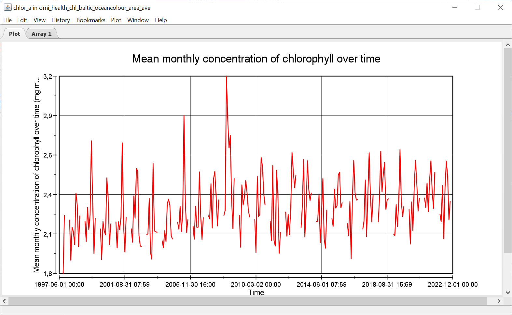
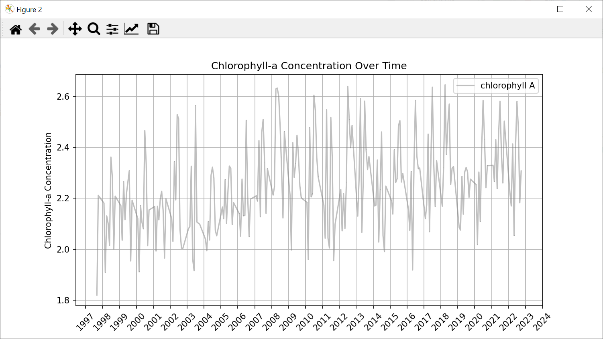
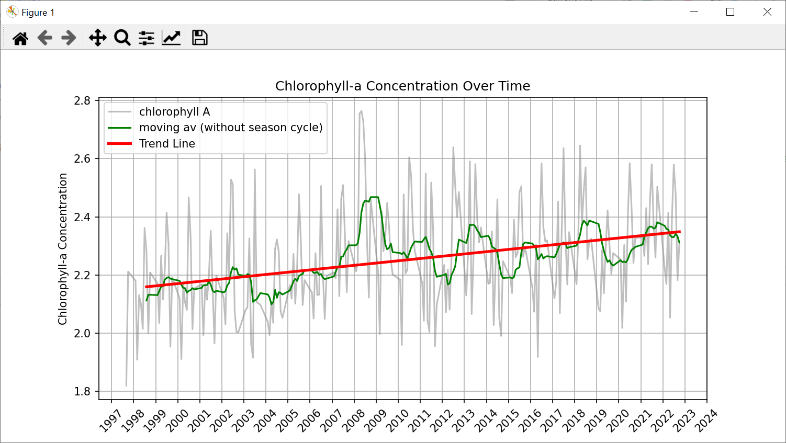
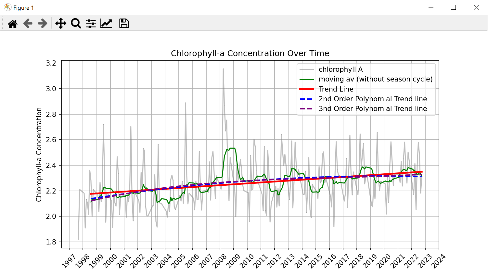
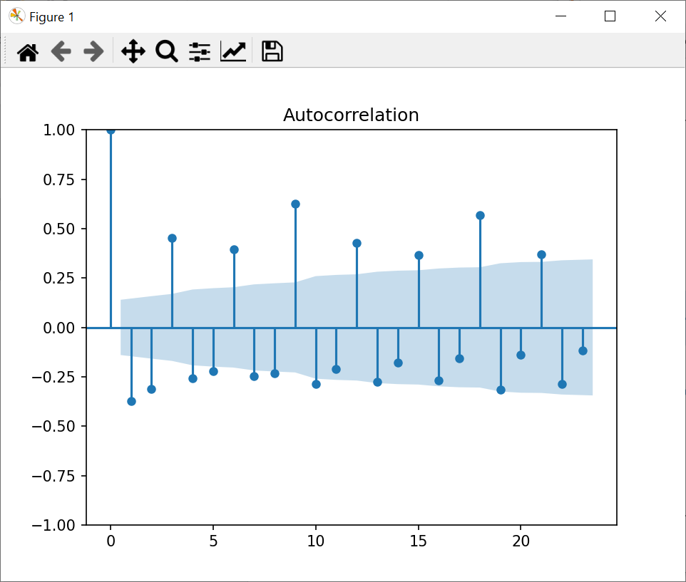
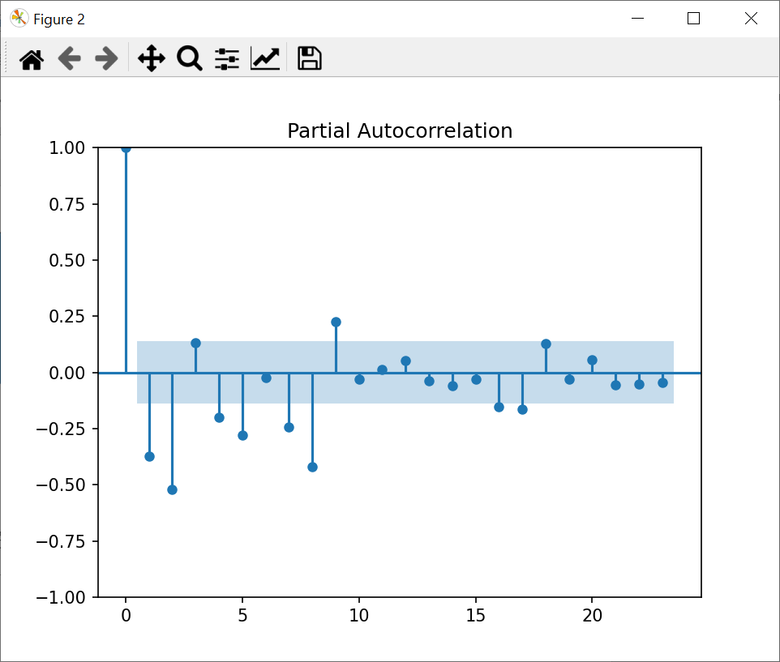
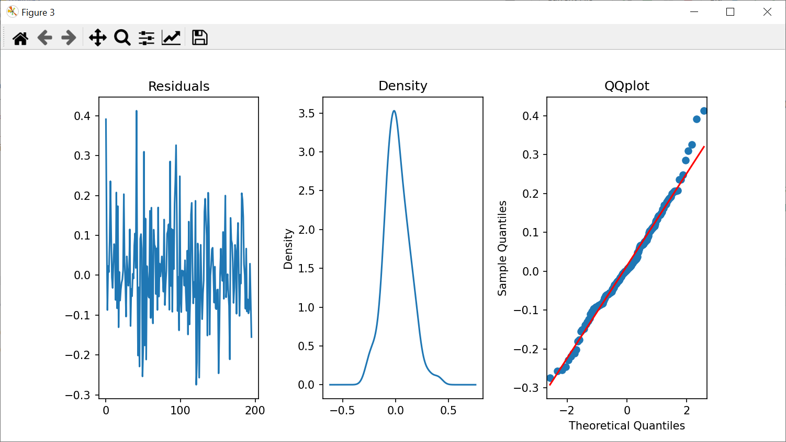
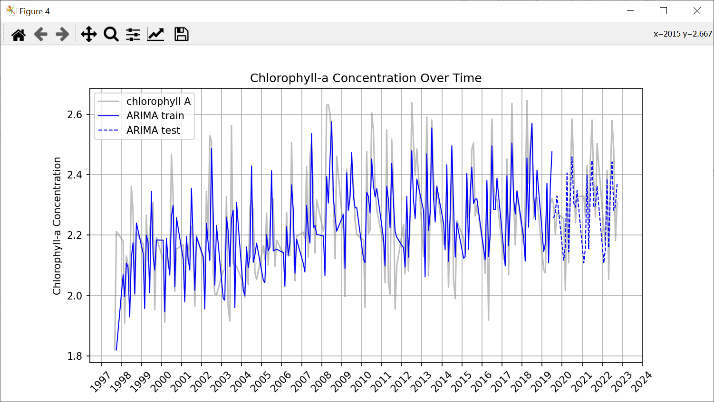

# Изучение методов регрессионного анализа и их  применение на практике
Автор: Щукин Антон Александрович, ГУАП 02.03.03 Математическое обеспечение и администрирование информационных систем, 2024

------------

### 1. Ведение
#### 1.1 Цель работы
Изучение методов регрессионного анализа и применение методов на анализе [временного ряда](http://https://marine.copernicus.eu/access-data/ocean-monitoring-indicators/baltic-sea-chlorophyll-time-series-and-trend-observations "временного ряда") изменения плотности Хлорофилла А в Балтийском море с 1977 года по 2022 год, определить, как с течением времени изменилось количество хлорофилла в воде, на основе статистических моделей попробовать предсказать будущие значения концентрации хлорофилла.

#### 1.2 Актуальность проблемы
Хлорофилл А – самая распространённая форма хлорофилла на Земле, является ключевым пигментом, используем в процессе фотосинтеза фитопланктоном.

Высокие уровни содержания хлорофилла в воде могут привести к чрезмерному росту водорослей, что может привести к “цветению воды”, снижению уровня кислорода и гибель водных организмов. Последствия гибели водных организмов могут привести к экологическим проблемам в конкретном водоёме и к экономическим проблемам в стране ввиду упадка рыболовства и туризма.

Изучение статистических методов анализа больших данных на практическом примере способствует лучшему пониманию методов и лучшему пониманию материала.

------------

### 2. Используемые технологии
В качестве основного языка программирования был использован Python. Данный язык имеет множество преимуществ:
- 	Python предоставляет обширный набор библиотек, множество функций и команд, которые помогают в изучении регрессионного анализа и облегчают работу.
- 	Python достаточно простой и читаемый язык, что делает код на языке Python понятным и простым в чтении и при разработке. Это особенно полезно для работы со сложными моделями и анализом данных.
- 	Python имеет множество библиотек, позволяющих строить графики и визуализировать данные.

**Используемые библиотеки:**
NetCDF4: Библиотека для чтения и работы с базами данных с расширением “nc” (файл данных в формате network Common Data Form).

NumPy (Numerical Python): Библиотека для работы с многомерными массивами и матрицами, также содержит множество математических функций для их обработки.

Pandas: Библиотека, основанная на NumPy, но содержит более обширный функционал для работы с матрицами.

Statmodels: Библиотека для статического моделирования, которая предоставляет классы и функции для оценки статистических моделей и проведения тестов.

Matplotlib: Библиотека, которая позволяет визуализировать данные и строить графики.

Warnings: Библиотека для игнорирования ошибок.

------------

### 3. Теоретические сведения
#### 3.1 Введение в регрессионный анализ
Регрессионный анализ — это набор статистических методов оценки отношений между переменными. Его можно использовать для оценки степени взаимосвязи между переменными и для моделирования будущей зависимости.

Зависимую переменную называют предиктором, в нашем случае это плотность содержания хлорофилла А в водоёме. Независимые переменные — те, которые могут объяснять поведение выше приведенных факторов, в нашем случае это время.

#### 3.2 Обработка входных данных

*Временной ряд* - это последовательность наблюдений за определенным параметром в разные моменты времени. Временной ряд содержит информацию о том, как изменяется параметр со временем.

*Стационарность* - это свойство временного ряда, которое означает, что его средние и стандартные отклонения не меняются со временем. Если временной ряд является стационарным, то его можно легко анализировать и прогнозировать. Нестационарный временной ряд может иметь *тренд* (постоянный рост или падение), *цикличность* (повторение циклов) или *сезонность* (повторение определенных событий в разное время года).

Большинство временных рядов нестационарные: они не имеют постоянного среднего значения, дисперсии, поэтому анализ и построение анализирующих моделей затруднительно. Прежде чем приступать к анализу временного ряда и к построению любых моделей прогнозирования необходимо привести его в стационарное состояние.

Из временного ряда можно убрать сезонность. Это можно сделать множеством способов, рассмотрим один из наиболее простых и распространённых методов – *метод скользящего среднего*.

Метод представляет собой некоторый способ локального усреднения данных, при котором не систематические компоненты взаимно погашают друг друга. Так, метод скользящей средней основан на переходе от начальных значений ряда к их средним значениям на интервале времени, длина которого выбрана заранее (данный интервал времени часто называют окном). При этом сам выбранный интервал “скользит” вдоль ряда. Размер окна зависит от периода повторений значений, например, при анализе концентрации хлорофилла в воде было выявлено, что, ввиду погодных условий, концентрация растёт в весенние и летние месяцы, а осенью и зимой падает и это происходит каждый год, то окно будет длинной в двенадцать значений.

Различают два метода нахождения скользящего среднего: искомый параметр находится в середине окна и в конце окна. Второй метод используется для вычисления скользящего среднего когда временной ряд пополняется в реальном времени. Второй метод также позволяет выбрать окно произвольной длинны, в то время как первый метод подразумевает только нечётные размеры окна. Суть метода нахождения скользящего среднего с искомым значением посередине окна заключается в следующем (1): 

$$
y_t = \frac{1}{p} \sum_{i=t-m}^{t+m} y_i
$$                                                              

где $$ y_t $$ – новое значение временного ряда с индексом *t*; *p* – размер окна; *m* – значение, которое определяется по формуле *m = (p – 1) / 2*.

Небольшие изменения в формуле метода нахождения скользящего среднего с искомым значением в конце окна (2): 
$$                                                              
y_t = \frac{1}{p} \sum_{i=t-p}^{t} y_i
$$                                                              

Метод нахождения скользящего среднего любыми способами подразумевает уменьшение длинны временного ряда.

Функция отображения скользящего среднего называется MA-моделью (Moving average).

Дифференцирование временного ряда - это процесс вычисления разностей последовательных значений ряда, что помогает устранить тренды и сделать ряд более стационарным. Формула для дифференциации первого порядка для элемента $$y_t$$ выглядит следующим образом (3):

$$                                                              
y_t' = y_t - y_{t-1}
$$                                                              
Где $$ y_t $$ — текущее значение временного ряда $$y$$; $$y_t'$$ — новое значение продифференцированного временного ряда.

Предположим существует временной ряд $$y$$ длинной в $$n$$ измерений:
$$
y = [y_1, y_2, y_3, ... y_n]
$$

После дифференциации первого порядка данного временного ряда, воспользовавшись формулой (3), получаем следующий ряд:

$$
y' =[(y_2-y_1 ),(y_3-y_2 ),…(y_n - y_{n-1})]
$$

Важно отметить, что, ввиду формулы дифференцирования, итоговый ряд получается на один элемент меньше исходного.

Иногда бывает необходимо выполнить дифференцирование несколько раз, чтобы полностью устранить тренды и сезонные эффекты. Например, дифференцирование второго порядка (4):

$$
y_t''=(y_t-y_{t-1})-(y_{t-1}- y_{t-2})= y_t-2*y_{t-1}+y_{t-2}
$$

После дифференцированного временного ряда итоговый ряд станет на два элемента меньше исходного.

Для проверки ряда на стационарность можно использовать *Расширенный тест Дики-Фуллера (ADF-тест)*. 

#### 3.3 Построение простой линейной регрессии

*Регрессия* — способ выбрать из семейства функций ту, которая минимизирует функцию потерь. Последняя характеризует насколько сильно пробная функция отклоняется от значений в заданных точках. Цель регрессии — найти коэффициенты линейной комбинации, и тем самым определить регрессионную функцию (которую также называют моделью). Модель может быть представлена разными функциями, в данной работе рассматривается полином n-ой степени.

$$
y = \beta_0 + \beta_1 \cdot x + \beta_2 \cdot x^2 + \ldots + \beta_n \cdot x^n
$$

где $$y$$ – вектор наблюдаемых значений; $$x$$ – независимая переменная; $$\beta_0,\beta_1,\beta_2,…\beta_n$$   – коэффициенты, которые необходимо найти; $$n$$ – степень полинома. 

Существует множество способов нахождения коэффициентов регрессии, рассмотрим один из самых распространённых методов – метод наименьших квадратов.

При методе наименьших квадратов необходимо найти вектор β, который состоит из необходимых коэффициентов. Для начала необходимо сформировать матрицу значений независимой переменной. Она выглядит следующим образом:

$$
X = \begin{bmatrix}
1 & x_1 & x_1^2 & \ldots & x_1^n \\
1 & x_2 & x_2^2 & \ldots & x_2^n \\
\vdots & \vdots & \vdots & \ddots & \vdots \\
1 & x_n & x_n^2 & \ldots & x_n^n
\end{bmatrix}
$$

Вектор β находится через следующую формулу (5):

$$
\hat{\beta} = (X^T X)^{-1} X^T y

$$

где $$\hatβ$$  – вектор коэффициентов; $$X$$ – матрица значений независимой переменной; $$y$$ – вектор зависимой переменной; $$X^T$$  - транспонированный вектор $$X$$. 

#### 3.4 Метрика

Чтобы оценить насколько модель правдоподобно предсказывает результаты, необходимо посчитать специальные количественные меры (*метрики*).

*MSE (Mean Squared Error)* - среднеквадратичная ошибка, измеряет среднюю величину квадратов ошибок между предсказанными значениями и истинными значениями. Чем меньше значение MSE, тем лучше модель соответствует данным. Формула вычисления MSE:

$$
\text{MSE} = \frac{1}{n} \sum_{i=1}^{n} (y_i - \hat{y}_i)^2
$$

где $$n$$ – количество наблюдений; $$y_i$$ – истинное значение; $$\hat y_i$$ – предсказанное значение.

Метрика MSE чувствительна к большим ошибкам, так как любые сильные отклонения предсказанных значений от истинных возводятся в квадрат. Это можно воспринимать по-разному: если важно минимизировать ошибки в модели, то чувствительность, безусловно, положительно сказывается на результате, но данная метрика чувствительна к выбросам, что может исказить оценку модели. Также MSE легко вычисляется, но результат выражается получается в квадрате единиц измерения целевой переменной, что затрудняет интерпретацию. 

*RMSE (Root Mean Squared Error)* - является квадратным корнем из MSE. RMSE считается по следующей формуле:

$$
\text{RMSE} = \sqrt{\text{MSE}} = \sqrt{\frac{1}{n} \sum_{i=1}^{n} (y_i - \hat{y}_i)^2}
$$

Данная метрика не так проста в вычислении, но выражает ошибку в тех же единицах, что и целевая переменная, что делает интерпретацию более интуитивной. Ввиду наличия корня менее чувствительна к выбросам. Оценивается RMSE так же, как и MSE: чем меньше значение, тем более правдоподобные результаты.

*AIC (Akaike Information Criterion)* – метрика, которая учитывает также сложность модели. Чем ниже значение AIC, тем лучше модель. AIC помогает выбрать модель, которая наилучшим образом балансирует точность и сложность. Формула для вычисления AIC:

$$
\text{AIC} = 2k - 2 \ln(L)
$$

где k – количество параметров модели; L – максимальное значение функции правдоподобия.

Данная метрика штрафует за добавление лишних параметров, предотвращая переобучение, позволяет сравнивать модели с разным числом параметров, но используется исключительно для сравнения моделей.

Рекомендуется использовать сочетание метрик для более корректных результатов.

#### 3.5 Лаги, ACF и PACF тесты

*Лаг* – отступ или задержка между наблюдаемыми значениями внутри временного ряда. Лаги формируются путем смещения временного ряда на определенное количество шагов назад или вперед. Например, лаг 𝑘 для временного ряда $$y_t$$ определяется как значение $$y_{t-k}$$, где 𝑘 — количество временных единиц назад.

Лаги играют важную роль в формировании более сложных моделей прогнозирования.

*Автокорреляционная функция (ACF)* – функция, которая измеряет корреляцию между временным рядом y_t и его отстающими. Если обычная корреляция — это поиск и выявление зависимостей у разных значений, то автокорреляция подразумевает работу с одним временным рядом и тем же временным рядом со смещением (то есть корреляция данных с самими собой). 

ACF представляет собой график лагов и показывает корреляцию между текущим значением временного ряда и его значениями в предыдущие моменты времени. Первый лаг на графике всегда равен единице, а остальные лаги варьируются в пределах (-1; 1).

*Частичная автокорреляционная функция (PACF)* – функция, которая измеряет прямую корреляцию между временным рядом $$y_t$$ и его отстающими значениями, учитывая влияние промежуточных лагов. PACF показывает только прямую корреляцию между $$y_t$$ и $$y_{t-k}$$, не учитывая влияние промежуточных значений.

Также после построения модели необходимо проверить её остаточные значения (остатки). Остатки представляют собой разницу между фактическими значениями наблюдений и предсказанными значениями, полученными от модели:

$$
e_t=y_t-y ̂_t
$$

Чтобы утвердить, что модель достоверна, остатки должны иметь случайный характер (должны иметь нормальное распределение) и не демонстрировать явных паттернов. Данную проверку можно сделать графически, построив графики остатков, их гистограмму распределения и QQplot, или аналитически, рассчитывая тест на нормальность распределения остатков и на наличие автокорреляции.

#### 3.6 Авторегрессионная модель (AR-модель)

*Авторегрессионная (AR) модель* — это статистическая модель, используемая для анализа и прогнозирования временных рядов. В AR модели текущее значение временного ряда выражается как линейная комбинация предыдущих значений (лагов) и стохастического терма (ошибки). Авторегрессионная модель порядка 𝑝 обозначаемая как 𝐴𝑅(𝑝), определяется следующим уравнением:

$$
y_t=c+φ_1*y_{t-1}+φ_2*y_{t-2}+⋯+φ_p*y_{t-p}
$$

где $$y_t$$ – значение временного ряда в момент времени t; $$c$$ – константа; $$φ_1,φ_2,… φ_p$$ – параметры модели.

Для построения AR-модели необходимо выбрать константу p. Для этого необходимо построить график частичной авторегрессии (PACF-тест). Чтобы выбрать константу p по результатам PACF-теста, нужно определить лаг, на котором значения резко падают относительно до примерно нуля и после этого остаются незначительными. При анализе PACF графика иногда может возникнуть такая проблема, что параметр p определить сложно, в таком случае определить оптимальное p можно только переборным алгоритмом с отслеживанием метрик AIC и RMSE.

Для корректного построения любых моделей необходимо разбить выборку на две части: обучающая и тестовая. Обучающая часть должна состоять из большей части выборки, на ней нужно обучить модель и подобрать нужные константы, а на тестовой – проверить метрики и оценить работоспособность модели.

Чтобы определить коэффициенты AR-модели, необходимо сначала сформировать матрицу наблюдений X и вектор ответов y. Матрица X будет иметь размерность *(n – p) × (p - 1)* и состоит из столбцов: первый столбец – все единицы, а остальные – значения лагов временного ряда y. Пример матрицы наблюдений X в общем виде:

$$
X = \begin{bmatrix}
1 & y_p & y_{p-1} & \ldots & y_1 \\
1 & y_{p-1} & y_p & \ldots & y_2\\
\vdots & \vdots & \vdots & \ddots & \vdots \\
1 & y_{n-1} & y_{n-2} &\ldots &y_{n-p} \\
\end{bmatrix}
$$

Вектор ответов y содержит значения временного ряда начиная с момента времени p + 1 до n. Далее, чтобы найти вектор коэффициентов φ воспользуемся формулой наименьших квадратов (5).

#### 3.7 Модель скользящего среднего (MA-модель)

Модель скользящего среднего (MA, Moving Average) - это модель временного ряда, которая описывает текущее значение ряда как линейную комбинацию прошлых ошибок (остатков). Модель MA(q) с порядком определения q записывается следующим образом:

$$
y_t=μ+e_t+ θ_1*e_{t-1}+θ_2*e_{t-2}+⋯+ θ_q*e_{t-q}
$$

где μ - среднее значение временного ряда (константа); $$e_t$$ - ошибка (остаток) на момент времени t; $$θ_1,θ_2,… θ_q$$ - коэффициенты модели скользящего среднего.

Для определения константы q необходимо построить график ACF (ACF-тест), нужно определить лаг, на котором значения резко падают относительно до примерно нуля и после этого остаются незначительными. Если опять не получился определить значение q по графику – нужно перебрать разные модели и найти лучшую.

#### 3.8 ARIMA-модель

*ARIMA (Auto Regressive Integrated Moving Average)* – популярная модель прогнозирования временных рядов, включает в себя три составляющие:
* *AR (AutoRegressive, Авторегрессионная составляющая)*: Этот компонент модели описывает зависимость текущего значения временного ряда от предыдущих значений.
* *I (Integrated, Интегрированный компонент)*: Этот компонент используется для приведения временного ряда к стационарному виду. Интегрирование означает взятие разностей между последовательными значениями ряда, что позволяет устранить тренды и сезонные эффекты.
* *MA (Moving Average, Скользящее среднее)*: Этот компонент модели описывает зависимость текущего значения временного ряда от предыдущих ошибок (остатков). Ошибки - это разницы между фактическими и предсказанными значениями.

Так как ARIMA-модель состоит из трёх составляющих, формула модели выглядит как композиция составляющих моделей:

$$
y_t=c+φ_1*y_{t-1}+φ_2*y_{t-2}+⋯+
φ_p y_{t-p}+θ_1*e_{t-1}+θ_2*e_{t-2}+⋯+θ_q*e_{1-q}+e_t
$$

ARIMA-модель записывается как ARIMA(p, d, q), чтобы её построить необходимо знать эти константы. Параметр d указывает на количество дифференцирований, необходимых для приведения временного ряда к стационарному виду. Параметры p и q определятся так же, как и для моделей AR и MA соответственно. 

------------

### 4. Практический раздел

Временной ряд был взят с сайта Copernicus.eu [1]. На сайте предоставлена база данных месячной концентрации хлорофилла А в Балтийском море в период с 1977 года по 2022 год с расширением “.nc” (файл данных в формате network Common Data Form). Чтобы открыть данный файл и просмотреть результаты, было использовано приложение “Panoply.exe”. Данные из файла выглядят следующим образом:

*Рисунок 4.1 – Визуализация данных без обработки*

График иллюстрирует концентрацию хлорофилла А по времени. На графике пропущены некоторые значения, при подробном анализе данных было выяснено, что пропущены зимние месяцы, в связи с чем была выдвинута теория, что замеры зимой не проводились ввиду природных факторов. В процессе работы было принято решение удалить пропущенные значения. 

Для работы с базой данных в Python были использованы библиотеки netCDF4, а именно модуль Dataset, matplotlib для визуализации результатов и построении графиков.  

*Рисунок 4.2 – Визуализация обработанных результатов*

На графике присутствуют заметные выбросы, вероятно, это результат цветения воды в благоприятные для этого времена года. Данные выбросы сильно портят статистику, поэтому их необходимо сгладить методом скользящего среднего. Было решено, что выброс – значение, большее 2,65 единиц, всё, что является выбросом было сглажено. Также была выведена функция скользящего среднего для всего временного ряда и по этим данным построен полином первой степени, чтобы отследить тенденцию роста или падения концентрации. 

*Рисунок 4.3 – Сглаженный график, скользящее среднее, полином*

Также были построены и визуализированы графики полиномов второго и третьего порядка.

*Рисунок 4.4 – полиномы высших степеней*

На рисунке 4.4 пунктирной синий прямой и пунктирной фиолетовой прямой изображены полиномы второй и третьей степеней. Они имеют лучшие показатели правдоподобия, чем полином первой степени, но хуже справляются со своей главной задачей: отображение тенденции роста/падения концентрации. В дальнейшем анализе было принято решение отказаться от этих моделей.

Для построения модели ARIMA необходимо было проверить ряд на стационарность (ADF-тест) и при необходимости продифференцировать. При первом ADF-тесте результаты показали, что ряд не стационарен (в результате работы функции adfuller() значение p-value было больше уровня значимости), поэтому ряд необходимо дифференцировать. После выполнения операции значение p-value стало достаточно мало, чтобы утверждать, что ряд приближен к стационарному. Далее необходимо построить графики автокорреляции и частичной автокорреляции (ACF и PACF).

*Рисунок 4.5 – ACF-тест*

*Рисунок 4.6 – PACF-тест*

Из рисунков 4.5 и 4.6 видно, что константы p и q для ARIMA-модели выбрать затруднительно, поэтому возникла необходимость перебрать разные ARIMA-модели и отследить ту, у которой RMSE и AIC минимальны. Было решено остановиться на модели ARIMA(8, 1, 10): эта модель имеет хорошие метрические показатели: RMSE = 0.1046 против RMSE = 0.1643 для линейного полинома, что показывает, что модель предсказывает данные заметно точнее, и AIC = -241.2202. 

Для проверки остатков были выведены графики остатков, их распределение и qqplot:

*Рисунок 4.7 – Анализ остатков*

На рисунке 4.7 видно, что график плотности распределения остатков близок нормальному распределению, а qqplot показывает, что, не считая последних значений, предсказанные значения практически совпадают с фактическими.

Из вышеперечисленного следует вывод, что ARIMA-модель хорошо подходит для предсказания данных плотности хлорофилла А.

*Рисунок 4.8 – ARIMA(8, 1, 10) на обучающей и тестовой выборке*

------------

### 5. ЗАКЛЮЧЕНИЕ

В результате выполнения данного практического задания было установлено, что концентрация хлорофилла А в Балтийском море выросла и продолжает расти в пределах нормы. Был выявлен тренд роста, по которому можно установить скорость увеличения концентрации. Также была построена статистическая модель, которая может прогнозировать результаты концентрации хлорофилла А на определённые сроки без учёта внеплановых ситуаций. 

В результате работы над практическим заданием были основаны некоторые методы статистического анализа, спроектировано несколько моделей прогнозирования и реализована проверка их правдоподобия.

------------

### 6. СПИСОК ИСПОЛЬЗУЕМЫХ ИСТОЧНИКОВ
1.	База данных концентрации хлорофилла А. URL: https://marine.copernicus.eu/access-data/ocean-monitoring-indicators/baltic-sea-chlorophyll-time-series-and-trend-observations (дата обращения: 30.06.2024).
2.	Письменный Д. Конспект лекций по теории вероятностей, математической статистике и случайным процессам – Москва :  Изд-во АЙРИС ПРЕСС, 2008. – 288 c.
3.	Метод скользящей средней. URL: https://studfile.net/preview/1091716/page:2/ (дата обращения 27.06.2024).
4.	How to build ARIMA models in Python for time series forecasting. URL: https://www.youtube.com/watch?v=-aCF0_wfVwY
5.	Метрики. URL: https://habr.com/ru/articles/820499/ (дата обращения 27.06. 2024).
6.	Matplotlib documentation. URL: https://matplotlib.org/stable/index.html (дата обращения 13.06.2024).

